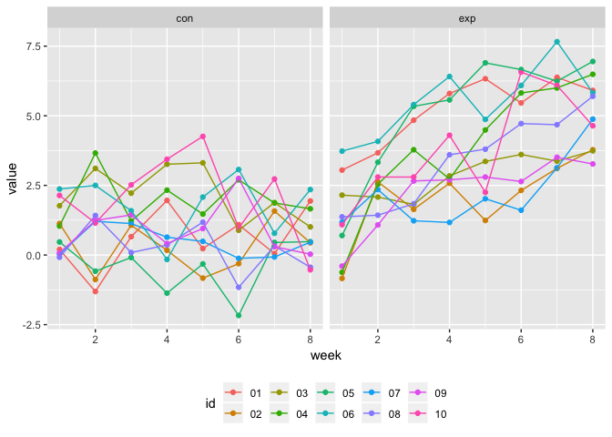
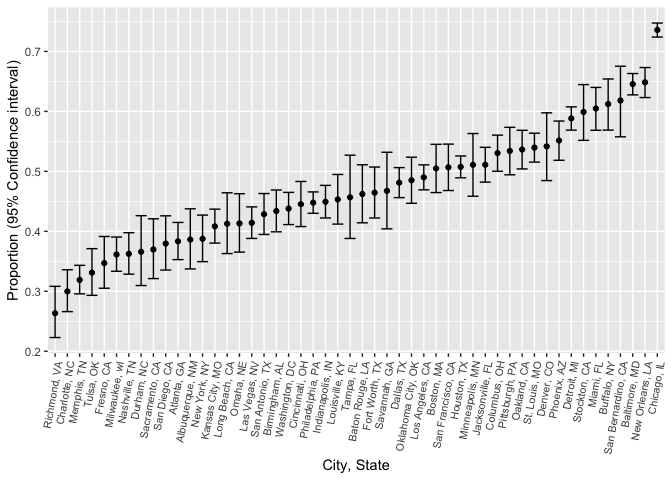

Homework 5
================
Amin Yakubu
11/6/2018

``` r
library(tidyverse)
library(plotly)
```

### Problem 1

Extracting the filepaths and names into lists

``` r
paths_and_names = tibble(filepath = list.files("./data/", pattern = "*.csv", full.names = TRUE),
                         filename = basename(filepath))
```

Writing function to read the data

``` r
read_fx = function(data){
  
  read_csv(file = data)
  
}
```

Now iterating using `map` function to read all the csv files and cleaning the data

``` r
df = paths_and_names %>% mutate(data =  purrr::map(paths_and_names$filepath, read_fx)) %>% 
  unnest() %>% 
  select(-filepath) %>% 
  gather(key = week, value = value, week_1:week_8) %>% 
  mutate(id = str_replace(filename, ".csv",""),
         week = as.numeric(str_replace(week, "week_", ""))) %>% 
  separate(id, into = c("group", "id"), sep = "_") %>% 
  mutate(id = as.factor(id))

ggplot(df, aes(x = week, y = value, color = id, group = id)) + geom_point() + geom_line() + facet_grid(~group) +
  theme(legend.position = "bottom")
```



### Problem 2

``` r
hom_df = read_csv("https://raw.githubusercontent.com/washingtonpost/data-homicides/master/homicide-data.csv", col_names = TRUE) %>% 
  mutate(city_state = str_c(city, ",", " ", state))
```

#### Description of dataset

The Washington Post has collect data on 52179criminal homicides over the past decade in 50 of the largest American cities. The dataset has 52179 observations x 13 variables. Variables include victim information like name, age, sex, and race. Geographic information collected also include city, state, longitude and latitude information. Finally the variable `desposition` records whether the homicide case was closed without any arrest, still open with no arrest and closed due to arrest.

Summary statistics

#### Summarizing within cities to obtain the total number of homicides and the number of unsolved homicides

``` r
summ_df = hom_df %>% 
  mutate(disposition = fct_collapse(hom_df$disposition, "No arrest" = c("Closed without arrest","Open/No arrest"))) %>% group_by(city_state) %>% 
  count(disposition) %>% 
  spread(key = disposition, value = n) %>% 
  janitor::clean_names() %>% 
  mutate(total = closed_by_arrest + no_arrest)
```

For the city of Baltimore, MD, using prop.test function to estimate the proportion of homicides that are unsolved

``` r
baltimore = summ_df %>% filter(city_state == "Baltimore, MD")

baltimore_prop = prop.test(baltimore$no_arrest, baltimore$total) %>% 
  broom::tidy() %>% 
  select(estimate, conf.low, conf.high) %>% 
  janitor::clean_names() %>% 
  knitr::kable()

baltimore_prop
```

|   estimate|  conf\_low|  conf\_high|
|----------:|----------:|-----------:|
|  0.6455607|  0.6275625|   0.6631599|

Now run prop.test for each of the cities in your dataset, and extract both the proportion of unsolved homicides and the confidence interval for each. Do this within a “tidy” pipeline, making use of purrr::map, purrr::map2, list columns and unnest as necessary to create a tidy dataframe with estimated proportions and CIs for each city.

#### Writing a function to do `prop.test` and clean the data

``` r
prop_test = function(data_table){
  
  try(prop.test(data_table$no_arrest, data_table$total) %>% 
    broom::tidy() %>% 
    select(estimate, conf.low, conf.high), silent = TRUE)
}
```

#### Iteration

``` r
unnested_ci_for_states = summ_df %>% group_by(city_state) %>% nest() %>% 
  mutate(estimate_ci = map(data, prop_test)) %>% filter(city_state != "Tulsa, AL") %>% unnest() %>% 
  mutate(city_state = reorder(city_state, estimate)) %>% janitor::clean_names()
```

#### Creating a plot that shows the estimates and CIs for each city

``` r
ggplot(unnested_ci_for_states, aes(x = city_state, y = estimate )) + 
  geom_point() + geom_errorbar(aes(ymin = conf_low, ymax = conf_high)) + 
  theme(axis.text.x = element_text(angle = 80, hjust = 1, size = 8)) +
  labs(
    x = "City, State",
    y = "Proportion (95% Confidence interval)"
  )
```


