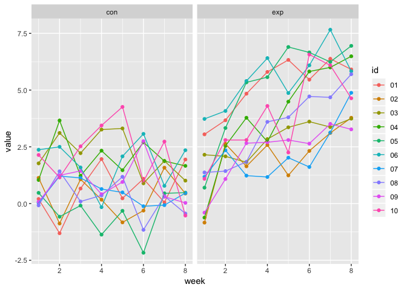
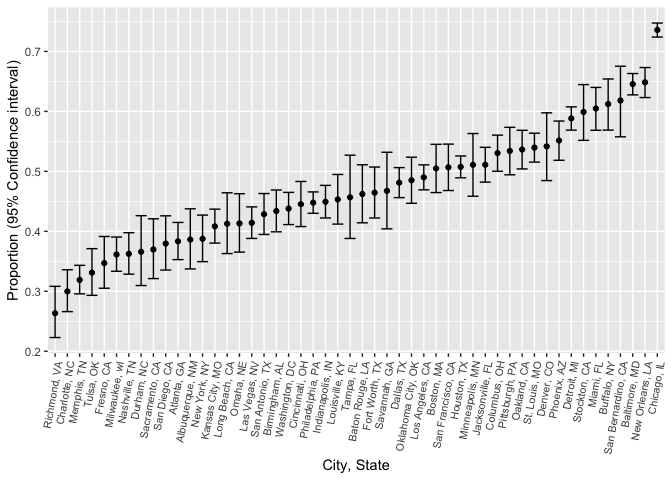

Homework 5
================
Amin Yakubu
11/6/2018

``` r
library(tidyverse)
```

    ## ── Attaching packages ───────────────────────────────────────────────────────────────────────────── tidyverse 1.2.1 ──

    ## ✔ ggplot2 3.0.0     ✔ purrr   0.2.5
    ## ✔ tibble  1.4.2     ✔ dplyr   0.7.6
    ## ✔ tidyr   0.8.1     ✔ stringr 1.3.1
    ## ✔ readr   1.1.1     ✔ forcats 0.3.0

    ## ── Conflicts ──────────────────────────────────────────────────────────────────────────────── tidyverse_conflicts() ──
    ## ✖ dplyr::filter() masks stats::filter()
    ## ✖ dplyr::lag()    masks stats::lag()

``` r
library(plotly)
```

    ## 
    ## Attaching package: 'plotly'

    ## The following object is masked from 'package:ggplot2':
    ## 
    ##     last_plot

    ## The following object is masked from 'package:stats':
    ## 
    ##     filter

    ## The following object is masked from 'package:graphics':
    ## 
    ##     layout

### Problem 1

Unzipping the file and

``` r
plyr::ldply(.data = "./data/hw5_data.zip", .fun = unzip)
```

    ##                  V1                           V2                V3
    ## 1 ./data/exp_05.csv ./__MACOSX/data/._exp_05.csv ./data/exp_04.csv
    ##                             V4                V5
    ## 1 ./__MACOSX/data/._exp_04.csv ./data/exp_10.csv
    ##                             V6                V7
    ## 1 ./__MACOSX/data/._exp_10.csv ./data/exp_06.csv
    ##                             V8                V9
    ## 1 ./__MACOSX/data/._exp_06.csv ./data/exp_07.csv
    ##                            V10               V11
    ## 1 ./__MACOSX/data/._exp_07.csv ./data/exp_03.csv
    ##                            V12               V13
    ## 1 ./__MACOSX/data/._exp_03.csv ./data/exp_02.csv
    ##                            V14               V15
    ## 1 ./__MACOSX/data/._exp_02.csv ./data/exp_01.csv
    ##                            V16               V17
    ## 1 ./__MACOSX/data/._exp_01.csv ./data/con_06.csv
    ##                            V18               V19
    ## 1 ./__MACOSX/data/._con_06.csv ./data/con_07.csv
    ##                            V20               V21
    ## 1 ./__MACOSX/data/._con_07.csv ./data/con_05.csv
    ##                            V22               V23
    ## 1 ./__MACOSX/data/._con_05.csv ./data/con_10.csv
    ##                            V24               V25
    ## 1 ./__MACOSX/data/._con_10.csv ./data/con_04.csv
    ##                            V26               V27
    ## 1 ./__MACOSX/data/._con_04.csv ./data/con_01.csv
    ##                            V28               V29
    ## 1 ./__MACOSX/data/._con_01.csv ./data/con_03.csv
    ##                            V30               V31
    ## 1 ./__MACOSX/data/._con_03.csv ./data/con_02.csv
    ##                            V32               V33
    ## 1 ./__MACOSX/data/._con_02.csv ./data/con_09.csv
    ##                            V34               V35
    ## 1 ./__MACOSX/data/._con_09.csv ./data/con_08.csv
    ##                            V36               V37
    ## 1 ./__MACOSX/data/._con_08.csv ./data/exp_09.csv
    ##                            V38               V39
    ## 1 ./__MACOSX/data/._exp_09.csv ./data/exp_08.csv
    ##                            V40               V41
    ## 1 ./__MACOSX/data/._exp_08.csv ./__MACOSX/._data

Extracting the filepaths and names into lists

``` r
filepaths = list.files("./data", pattern = "*.csv", full.names = TRUE)

filenames = basename(filepaths)
```

Writing function to read the data

``` r
read_fx = function(data, name){
  
  list(read_csv(file = data) %>% mutate(id = name))
  
}
```

Now iterating using `map` function to read all the csv files and bind them together

``` r
names_and_paths = purrr::map2(filepaths, filenames, read_fx)
```

    ## Parsed with column specification:
    ## cols(
    ##   week_1 = col_double(),
    ##   week_2 = col_double(),
    ##   week_3 = col_double(),
    ##   week_4 = col_double(),
    ##   week_5 = col_double(),
    ##   week_6 = col_double(),
    ##   week_7 = col_double(),
    ##   week_8 = col_double()
    ## )
    ## Parsed with column specification:
    ## cols(
    ##   week_1 = col_double(),
    ##   week_2 = col_double(),
    ##   week_3 = col_double(),
    ##   week_4 = col_double(),
    ##   week_5 = col_double(),
    ##   week_6 = col_double(),
    ##   week_7 = col_double(),
    ##   week_8 = col_double()
    ## )
    ## Parsed with column specification:
    ## cols(
    ##   week_1 = col_double(),
    ##   week_2 = col_double(),
    ##   week_3 = col_double(),
    ##   week_4 = col_double(),
    ##   week_5 = col_double(),
    ##   week_6 = col_double(),
    ##   week_7 = col_double(),
    ##   week_8 = col_double()
    ## )
    ## Parsed with column specification:
    ## cols(
    ##   week_1 = col_double(),
    ##   week_2 = col_double(),
    ##   week_3 = col_double(),
    ##   week_4 = col_double(),
    ##   week_5 = col_double(),
    ##   week_6 = col_double(),
    ##   week_7 = col_double(),
    ##   week_8 = col_double()
    ## )
    ## Parsed with column specification:
    ## cols(
    ##   week_1 = col_double(),
    ##   week_2 = col_double(),
    ##   week_3 = col_double(),
    ##   week_4 = col_double(),
    ##   week_5 = col_double(),
    ##   week_6 = col_double(),
    ##   week_7 = col_double(),
    ##   week_8 = col_double()
    ## )
    ## Parsed with column specification:
    ## cols(
    ##   week_1 = col_double(),
    ##   week_2 = col_double(),
    ##   week_3 = col_double(),
    ##   week_4 = col_double(),
    ##   week_5 = col_double(),
    ##   week_6 = col_double(),
    ##   week_7 = col_double(),
    ##   week_8 = col_double()
    ## )
    ## Parsed with column specification:
    ## cols(
    ##   week_1 = col_double(),
    ##   week_2 = col_double(),
    ##   week_3 = col_double(),
    ##   week_4 = col_double(),
    ##   week_5 = col_double(),
    ##   week_6 = col_double(),
    ##   week_7 = col_double(),
    ##   week_8 = col_double()
    ## )
    ## Parsed with column specification:
    ## cols(
    ##   week_1 = col_double(),
    ##   week_2 = col_double(),
    ##   week_3 = col_double(),
    ##   week_4 = col_double(),
    ##   week_5 = col_double(),
    ##   week_6 = col_double(),
    ##   week_7 = col_double(),
    ##   week_8 = col_double()
    ## )
    ## Parsed with column specification:
    ## cols(
    ##   week_1 = col_double(),
    ##   week_2 = col_double(),
    ##   week_3 = col_double(),
    ##   week_4 = col_double(),
    ##   week_5 = col_double(),
    ##   week_6 = col_double(),
    ##   week_7 = col_double(),
    ##   week_8 = col_double()
    ## )
    ## Parsed with column specification:
    ## cols(
    ##   week_1 = col_double(),
    ##   week_2 = col_double(),
    ##   week_3 = col_double(),
    ##   week_4 = col_double(),
    ##   week_5 = col_double(),
    ##   week_6 = col_double(),
    ##   week_7 = col_double(),
    ##   week_8 = col_double()
    ## )
    ## Parsed with column specification:
    ## cols(
    ##   week_1 = col_double(),
    ##   week_2 = col_double(),
    ##   week_3 = col_double(),
    ##   week_4 = col_double(),
    ##   week_5 = col_double(),
    ##   week_6 = col_double(),
    ##   week_7 = col_double(),
    ##   week_8 = col_double()
    ## )
    ## Parsed with column specification:
    ## cols(
    ##   week_1 = col_double(),
    ##   week_2 = col_double(),
    ##   week_3 = col_double(),
    ##   week_4 = col_double(),
    ##   week_5 = col_double(),
    ##   week_6 = col_double(),
    ##   week_7 = col_double(),
    ##   week_8 = col_double()
    ## )
    ## Parsed with column specification:
    ## cols(
    ##   week_1 = col_double(),
    ##   week_2 = col_double(),
    ##   week_3 = col_double(),
    ##   week_4 = col_double(),
    ##   week_5 = col_double(),
    ##   week_6 = col_double(),
    ##   week_7 = col_double(),
    ##   week_8 = col_double()
    ## )

    ## Parsed with column specification:
    ## cols(
    ##   week_1 = col_double(),
    ##   week_2 = col_double(),
    ##   week_3 = col_double(),
    ##   week_4 = col_double(),
    ##   week_5 = col_double(),
    ##   week_6 = col_double(),
    ##   week_7 = col_integer(),
    ##   week_8 = col_double()
    ## )

    ## Parsed with column specification:
    ## cols(
    ##   week_1 = col_double(),
    ##   week_2 = col_double(),
    ##   week_3 = col_double(),
    ##   week_4 = col_double(),
    ##   week_5 = col_double(),
    ##   week_6 = col_double(),
    ##   week_7 = col_double(),
    ##   week_8 = col_double()
    ## )
    ## Parsed with column specification:
    ## cols(
    ##   week_1 = col_double(),
    ##   week_2 = col_double(),
    ##   week_3 = col_double(),
    ##   week_4 = col_double(),
    ##   week_5 = col_double(),
    ##   week_6 = col_double(),
    ##   week_7 = col_double(),
    ##   week_8 = col_double()
    ## )
    ## Parsed with column specification:
    ## cols(
    ##   week_1 = col_double(),
    ##   week_2 = col_double(),
    ##   week_3 = col_double(),
    ##   week_4 = col_double(),
    ##   week_5 = col_double(),
    ##   week_6 = col_double(),
    ##   week_7 = col_double(),
    ##   week_8 = col_double()
    ## )
    ## Parsed with column specification:
    ## cols(
    ##   week_1 = col_double(),
    ##   week_2 = col_double(),
    ##   week_3 = col_double(),
    ##   week_4 = col_double(),
    ##   week_5 = col_double(),
    ##   week_6 = col_double(),
    ##   week_7 = col_double(),
    ##   week_8 = col_double()
    ## )
    ## Parsed with column specification:
    ## cols(
    ##   week_1 = col_double(),
    ##   week_2 = col_double(),
    ##   week_3 = col_double(),
    ##   week_4 = col_double(),
    ##   week_5 = col_double(),
    ##   week_6 = col_double(),
    ##   week_7 = col_double(),
    ##   week_8 = col_double()
    ## )
    ## Parsed with column specification:
    ## cols(
    ##   week_1 = col_double(),
    ##   week_2 = col_double(),
    ##   week_3 = col_double(),
    ##   week_4 = col_double(),
    ##   week_5 = col_double(),
    ##   week_6 = col_double(),
    ##   week_7 = col_double(),
    ##   week_8 = col_double()
    ## )

``` r
df = purrr::map_df(names_and_paths, bind_rows)

tidy_data = df %>%
  gather(key = week, value = value, week_1:week_8) %>% 
  mutate(id = str_replace(id, ".csv",""),
         week = as.numeric(str_replace(week, "week_", ""))) %>% 
  separate(id, into = c("group", "id"), sep = "_") %>% 
  mutate(id = as.factor(id))

ggplot(tidy_data, aes(x = week, y = value, color = id, group = id)) + geom_point() + geom_line() + facet_grid(~group) 
```



Problem 2
---------

``` r
hom_df = read_csv("data/data_problem2/homicide-data.csv", col_names = TRUE) %>% 
  mutate(city_state = str_c(city, ",", " ", state))
```

    ## Parsed with column specification:
    ## cols(
    ##   uid = col_character(),
    ##   reported_date = col_integer(),
    ##   victim_last = col_character(),
    ##   victim_first = col_character(),
    ##   victim_race = col_character(),
    ##   victim_age = col_character(),
    ##   victim_sex = col_character(),
    ##   city = col_character(),
    ##   state = col_character(),
    ##   lat = col_double(),
    ##   lon = col_double(),
    ##   disposition = col_character()
    ## )

Describe dataset ---

Summary statistics

Summarize within cities to obtain the total number of homicides and the number of unsolved homicides (those for which the disposition is “Closed without arrest” or “Open/No arrest”).

``` r
summ_df = hom_df %>% 
  mutate(disposition = fct_collapse(hom_df$disposition, "No arrest" = c("Closed without arrest","Open/No arrest"))) %>% group_by(city_state) %>% 
  count(disposition) %>% 
  spread(key = disposition, value = n) %>% 
  janitor::clean_names() %>% 
  mutate(total = closed_by_arrest + no_arrest)
```

For the city of Baltimore, MD, use the prop.test function to estimate the proportion of homicides that are unsolved; save the output of prop.test as an R object, apply the broom::tidy to this object and pull the estimated proportion and confidence intervals from the resulting tidy dataframe.

``` r
baltimore = summ_df %>% filter(city_state == "Baltimore, MD")

prop.test(baltimore[[3]], baltimore[[4]]) %>% broom::tidy() %>% .[c(1, 5, 6)] %>% 
  mutate(city_state = baltimore$city_state) %>% 
  select(city_state, everything())
```

    ## # A tibble: 1 x 4
    ##   city_state    estimate conf.low conf.high
    ##   <chr>            <dbl>    <dbl>     <dbl>
    ## 1 Baltimore, MD    0.646    0.628     0.663

Now run prop.test for each of the cities in your dataset, and extract both the proportion of unsolved homicides and the confidence interval for each. Do this within a “tidy” pipeline, making use of purrr::map, purrr::map2, list columns and unnest as necessary to create a tidy dataframe with estimated proportions and CIs for each city.

Writing a function for `prop.test`

First creating a nested dataset

``` r
nested_summary = nest(summ_df, closed_by_arrest:total)

# Testing the indices of my nested data

#taking the second row(city), and then 2nd variable in the nested data
x = as.numeric(pull(nested_summary$data[[2]][2]))

#taking the second row(city), and then 3rd variable in the nested data
b = as.numeric(pull(nested_summary$data[[2]][3]))

#computing proportion and CI
prop.test(x, b) %>% broom::tidy() %>% .[c(1, 5, 6)] %>% 
  mutate(city_state = nested_summary$city_state[2]) %>% 
  select(city_state, everything())
```

    ## # A tibble: 1 x 4
    ##   city_state  estimate conf.low conf.high
    ##   <chr>          <dbl>    <dbl>     <dbl>
    ## 1 Atlanta, GA    0.383    0.353     0.415

``` r
#Function with just one input determing the row of data. `Try` added to overlook errors

prop_test_fx = function(i){
  
  x = as.numeric(pull(nested_summary$data[[i]][2]))

  b = as.numeric(pull(nested_summary$data[[i]][3]))
  
  try(data.frame(prop.test(x, b) %>% 
                   broom::tidy() %>% 
                   .[1:6] %>% 
                   select(-statistic, -p.value, -parameter) %>% 
                   mutate(city_state = nested_summary$city_state[i]) %>% 
                   select(city_state, everything())), silent = TRUE)

}
```

Iteration

``` r
#list of rows to iterate

num = 1:51

ci = map(.x = num, ~ prop_test_fx(.x))

city_and_state = as.tibble(summ_df$city_state)

ci_for_states = city_and_state %>% mutate(data = ci) %>% filter(value != "Tulsa, AL")

unnested_ci_for_states = bind_rows(ci_for_states) %>% unnest(ci_for_states$data) %>% janitor::clean_names() 
```

Create a plot that shows the estimates and CIs for each city – check out geom\_errorbar for a way to add error bars based on the upper and lower limits. Organize cities according to the proportion of unsolved homicides.

``` r
unnested_ci_for_states %>% 
  mutate(city_state = factor(city_state, estimate))
```

    ## # A tibble: 50 x 6
    ##    value          data              city_state estimate conf_low conf_high
    ##    <chr>          <list>            <fct>         <dbl>    <dbl>     <dbl>
    ##  1 Albuquerque, … <data.frame [1 ×… <NA>          0.386    0.337     0.438
    ##  2 Atlanta, GA    <data.frame [1 ×… <NA>          0.383    0.353     0.415
    ##  3 Baltimore, MD  <data.frame [1 ×… <NA>          0.646    0.628     0.663
    ##  4 Baton Rouge, … <data.frame [1 ×… <NA>          0.462    0.414     0.511
    ##  5 Birmingham, AL <data.frame [1 ×… <NA>          0.434    0.399     0.469
    ##  6 Boston, MA     <data.frame [1 ×… <NA>          0.505    0.465     0.545
    ##  7 Buffalo, NY    <data.frame [1 ×… <NA>          0.612    0.569     0.654
    ##  8 Charlotte, NC  <data.frame [1 ×… <NA>          0.300    0.266     0.336
    ##  9 Chicago, IL    <data.frame [1 ×… <NA>          0.736    0.724     0.747
    ## 10 Cincinnati, OH <data.frame [1 ×… <NA>          0.445    0.408     0.483
    ## # ... with 40 more rows

``` r
ggplot(unnested_ci_for_states, aes(x = reorder(city_state, estimate), y = estimate )) + 
  geom_point() + geom_errorbar(aes(ymin = conf_low, ymax = conf_high)) + 
  theme(axis.text.x = element_text(angle = 80, hjust = 1, size = 8)) +
  labs(
    x = "City, State",
    y = "Proportion (95% Confidence interval)"
  )
```



-------------------------------------------------------------------------------
-------------------------------------------------------------------------------

############# 

prop\_test\_fx = function(data, i){

y = summ\_df\[seq(i, i),\]

x\_out = prop.test(y\[\[3\]\], y\[\[4\]\]) %&gt;% broom::tidy() %&gt;% .\[1:6\] %&gt;% select(-statistic, -p.value, -parameter) %&gt;% mutate(city\_state = y$city\_state) %&gt;% select(city\_state, everything())

list(x\_out)

}

nums = list(1:51)

map2(summ\_df, nums, prop\_test\_fx)

prop\_test\_fx = function(data, state){

y = data %&gt;% filter(city\_state == "state")

x\_out = prop.test(y\[\[2\]\], y\[\[4\]\]) %&gt;% broom::tidy() %&gt;% .\[1:6\] %&gt;% select(-statistic, -p.value, -parameter) %&gt;% mutate(city\_state = y$city\_state) %&gt;% select(city\_state, everything())

list(x\_out)

states &lt;- as.tibble(summ\_df$city\_state)

map2(summ\_df, states, prop\_test\_fx)

prop\_test\_fx(data = summ\_df, state = "Baltimore, MD")
